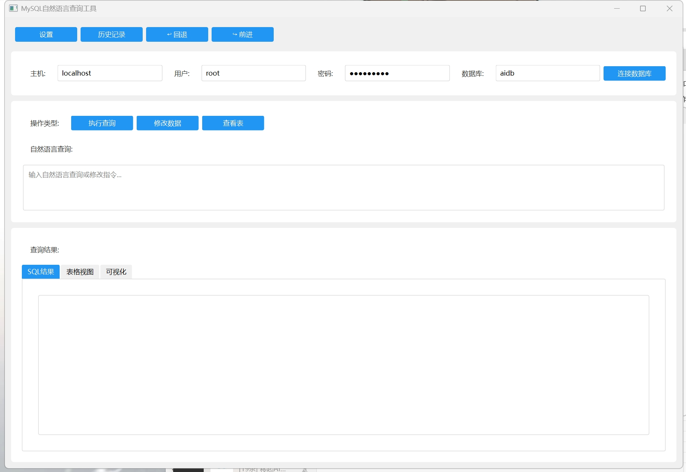

# MySQL自然语言查询工具


## 📝 项目简介

MySQL自然语言查询工具是一款革命性的数据库交互应用，它使用先进的自然语言处理技术，让您能够用日常中文或英文与数据库对话。无需编写复杂的SQL语句，即可轻松查询和管理您的MySQL数据库。




## ✨ 核心特性

- **自然语言交互**：使用日常中文或英文描述您的需求，系统自动转换为SQL语句
- **直观的数据可视化**：自动将查询结果转换为图表，帮助您更好地理解数据
- **表结构自动识别**：自动分析数据库结构，智能推断查询意图
- **表字段信息展示**：直观显示数据表字段类型和结构
- **一键表格浏览**：快速查看数据库中所有表的内容
- **操作历史记录**：自动保存所有操作，支持撤销和重做
- **智能回滚机制**：自动生成回滚SQL，确保数据安全
- **多种结果展示**：SQL代码、表格和可视化三种方式呈现结果

## 🔧 安装指南

### 系统要求

- Python 3.8+
- MySQL 5.7+
- 大语言模型支持：OpenAI API 或 本地Ollama模型

### 安装步骤

1. 克隆仓库到本地：
   ```bash
   git clone https://github.com/Misty-Star/Speak2SQL.git
   cd Speak2SQL
   ```

2. 创建并激活虚拟环境：
   ```bash
   python -m venv .venv
   # Windows
   .venv\Scripts\activate
   # Linux/macOS
   source .venv/bin/activate
   ```

3. 安装依赖包：
   ```bash
   pip install -r requirements.txt
   ```

4. 配置大语言模型：
   - OpenAI API：需要设置API密钥
   - Ollama：需要安装Ollama并加载所需模型

## 🚀 快速开始

1. 启动应用：
   ```bash
   python main.py
   ```

2. 连接数据库：
   - 输入MySQL服务器地址
   - 输入用户名和密码
   - 输入数据库名称
   - 点击"连接数据库"

3. 使用自然语言进行查询：
   - 在查询框中输入您的问题，如："查询所有学生的平均成绩"
   - 点击"执行查询"按钮

4. 浏览数据表：
   - 点击"查看表"按钮
   - 在弹出的对话框中选择要查看的表
   - 表内容将显示在表格视图中

## 📊 功能详解

### 自然语言查询

只需用日常语言描述您的需求，系统就能自动生成并执行SQL语句。例如：

- "查询年龄大于20岁的学生"
- "统计每个班级的男女学生人数"
- "查找2023年入学的学生信息"

### 数据修改操作

支持通过自然语言进行数据修改，系统会自动生成执行脚本和回滚脚本：

- "删除名为张三的学生记录"
- "将李四的年龄改为22岁"
- "添加一个新学生王五，年龄19岁，性别男"

### 数据可视化

自动将查询结果转换为适合的图表类型：

- 数值数据：柱状图、折线图
- 分类数据：饼图、条形图
- 时间序列：趋势图

### 字段信息显示

表格视图上方会显示表的结构信息，包括：

- 表名
- 字段名
- 字段数据类型（以易于理解的方式呈现）

### 历史记录管理

系统自动记录所有操作，支持：

- 查看历史记录
- 重新执行历史操作
- 撤销修改操作（使用自动生成的回滚SQL）

## 🔍 技术实现

本项目采用现代化的技术栈：

- **前端界面**：PySide6 (Qt for Python)
- **数据处理**：pandas, numpy
- **数据可视化**：matplotlib, seaborn
- **数据库连接**：mysql-connector-python
- **自然语言处理**：基于大型语言模型（LLM）技术
- **AI引擎**：支持OpenAI API和Ollama（本地模型）

### 系统架构

```
┌─────────────┐    ┌─────────────┐    ┌─────────────┐
│    用户界面  │◄───┤  核心控制器  │◄───┤  数据库连接 │
│  (PySide6)  │    │ (控制逻辑)   │    │ (MySQL)    │
└─────────────┘    └──────┬──────┘    └─────────────┘
                          │
                  ┌───────▼──────┐
                  │  自然语言处理 │
                  │  (LLM API)   │
                  └──────────────┘
```

## 🤝 贡献指南

我们欢迎各种形式的贡献，包括功能请求、错误报告和代码贡献。

1. Fork本仓库
2. 创建您的特性分支 (`git checkout -b feature/amazing-feature`)
3. 提交您的更改 (`git commit -m '添加了一些很棒的功能'`)
4. 推送到分支 (`git push origin feature/amazing-feature`)
5. 创建Pull Request

## 📜 许可证

本项目采用MIT许可证。详见 [LICENSE](LICENSE) 文件。

## 📞 联系方式

如有任何问题或建议，请通过以下方式联系我们：

- 邮箱：mistystar2524@gmail.com
- GitHub Issues：[创建新Issue](https://github.com/Misty-Star/Speak2SQL/issues)

---

**MySQL自然语言查询工具** - 让数据库交互如对话般简单！
